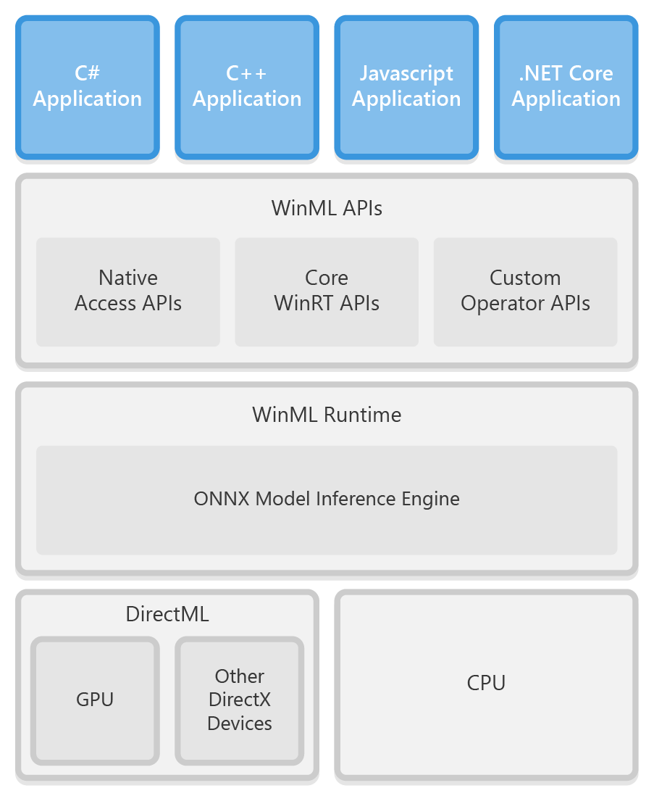

# Windows Machine Learning

Implement AI in your Windows apps using Windows ML&mdash;a high-performance, reliable API for running ML inferences on Windows devices.

## Overview

With Windows ML, developers can use trained ML models in Windows apps that are written in C#, C++, JavaScript, or Python, either locally on a Windows 10 device or on a Windows Server 2019 machine. The process of incorporating trained ML models into your application code is simple, requiring just a few straightforward steps:

1. Get a trained Open Neural Network Exchange (ONNX) model, or convert models trained in other ML frameworks into ONNX with [WinMLTools](convert-model-winmltools.md).

2. Add the ONNX model file to your application, or make it available in some other way on the target device.

3. Integrate the model into your application code, then build and deploy the application.

:::row:::
    :::column:::
    When your application runs, the Windows ML runtime (which contains the ONNX Model Inference Engine) evaluates the trained model on the Windows 10 device (or Windows Server 2019 if targeting a server deployment). Windows ML handles the hardware abstraction, allowing developers to target a broad range of silicon&mdash;including CPUs, GPUs, and, in the future, AI accelerators. Windows ML hardware acceleration is built on top of [DirectML](https://docs.microsoft.com/windows/desktop/direct3d12/dml), a high-performance, low-level API for running ML inferences that is part of the DirectX family.
    :::column-end:::
    :::column:::
        
    :::column-end:::
:::row-end:::

Windows ML provides developers with the following advantages:

- **Ease of development**: With Windows ML built into the latest versions of Windows 10 and Windows Server 2019, all you need is Visual Studio and a trained ONNX model, which can be distributed along with the Windows application.

- **Broad hardware support**: Windows ML allows you to write your ML workload once and automatically get highly optimized performance across different hardware vendors and silicon types, such as CPUs, GPUs, and AI accelerators. In addition, Windows ML guarantees consistent behavior across the range of supported hardware.

- **Low latency, real-time results**: ML models can be evaluated using the processing capabilities of the Windows device, enabling local, real-time analysis of large data volumes, such as images and video. Results are available quickly and efficiently for use in performance-intensive workloads like game engines, or background tasks such as indexing for search.

- **Increased flexibility**: The option to evaluate ML models locally on Windows devices lets you address a broader range of scenarios. For example, evaluation of ML models can run while the device is offline, or when faced with intermittent connectivity. This also lets you address scenarios where not all data can be sent to the cloud due to privacy or data sovereignty issues.

- **Reduced operational costs**: Training ML models in the cloud and then evaluating them locally on Windows devices can deliver significant savings in bandwidth costs, with only minimal data sent to the cloud&mdash;as might be needed for continual improvement of your ML model. Moreover, when deploying the ML model in a server scenario, developers can leverage Windows ML hardware acceleration to speed-up model serving, reducing the amount of machines needed in order to handle the workload.

To see Windows ML in action, you can try out the sample apps in the [Windows-Machine-Learning repo on GitHub](https://github.com/Microsoft/Windows-Machine-Learning).

For the latest Windows ML features and fixes, see our [release notes](release-notes.md).

The following video gives a brief overview of Windows Machine Learning.

 

> [!VIDEO https://www.youtube.com/embed/riGxT0Pd6IA]

## Other machine learning solutions from Microsoft

Microsoft offers a variety of machine learning solutions to suit your needs. These solutions run in the cloud, on-premises, and locally on the device. See [What are the machine learning product options from Microsoft?](https://docs.microsoft.com/azure/machine-learning/service/overview-more-machine-learning) for more information.

[!INCLUDE [help](../includes/get-help.md)]
