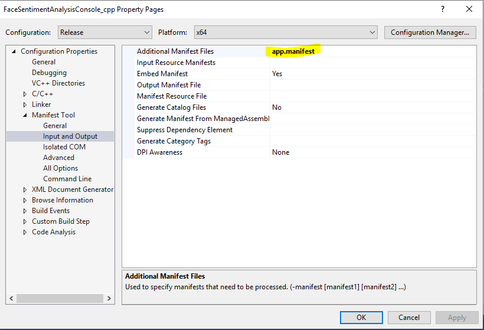

# Tutorial: Create a vision skill desktop application (C++)

> [!NOTE]
> If you are creating a skill that needs to be used in a non-UWP app, like a Win32 or .NET Core desktop application.
You need to modify the Skill to make sure the Skill is aware of the environment.

In this tutorial, you'll learn how to:

- Modify the Skill package to be container aware.
- Provide manifest and header files.

---

## Prerequisites

- [Visual Studio 2019](https://visualstudio.microsoft.com/downloads/) (or Visual Studio 2017, version 15.7.4 or later)
- Windows 10, version 1809 or later
- [Windows 10 SDK](https://developer.microsoft.com/windows/downloads/windows-10-sdk), version 1809 or later

---

1. Make sure that the skill is UWP container aware:

- Detecting app container environment from the skill:

Example code:

```cpp
// helper function to determine if the skill is being called from a UWP app container or not.
bool IsUWPContainer()
{
    HANDLE hProcessToken = INVALID_HANDLE_VALUE;
    HANDLE hProcess;
    hProcess = GetCurrentProcess();

    if (!OpenProcessToken(hProcess, TOKEN_QUERY, &hProcessToken))
    {
        throw winrt::hresult(HRESULT_FROM_WIN32(GetLastError()));
    }

    BOOL bIsAppContainer = false;
    DWORD dwLength;

    if (!GetTokenInformation(hProcessToken, TokenIsAppContainer, &bIsAppContainer, sizeof(bIsAppContainer), &dwLength))
    {
        // if we were denied token information we are definitely not in an app container.
        bIsAppContainer = false;
    }

    return bIsAppContainer;
}
```

- If skill is invoked from a UWP app container or UWP packaged container the file access is limited to app package paths. Hence, any model file or dependencies need to be packaged and loaded from container paths.
However if the skill is invoked from a non-container environment like regular win32 cpp or .net core desktop app, then the app container environment is not available. Instead most of the disk access will  be available as per the permissions of the desktop app consuming the skill. It may be a good practice to keep model files and other resources at the same location to the skill's dll location

Example code:

```csharp
winrt::Windows::Storage::StorageFile modelFile = nullptr;
if (IsUWPContainer())
{
    auto modelFile = Windows::Storage::StorageFile::GetFileFromApplicationUriAsync(Windows::Foundation::Uri(L"ms-appx:///Contoso.FaceSentimentAnalyzer/" + WINML_MODEL_FILENAME)).get();
}
else
{
    WCHAR DllPath[MAX_PATH] = { 0 };
    GetModuleFileName(NULL, DllPath, _countof(DllPath));
    auto file = Windows::Storage::StorageFile::GetFileFromPathAsync(DllPath).get();
    auto folder = file.GetParentAsync().get();
    modelFile = folder.GetFileAsync(WINML_MODEL_FILENAME).get();
```

1. Provide (package in Nuget) header files  (.h) and .manifest files for ease of consumption by Win32 cpp or .net core app developers.

a. Header files for C++ apps

- WINRT cpp component =>  Project properties -> MIDL -> output -> Header File
- WinRT C# component => winmdidl tool to convert .winmd to .idl ; and midlrt to convert .idl to header files.
- Generate .idl from. winmd
winmdidl <filename.winmd> /utf8 /metadata_dir:<path-to-sdk-unionmetadata> /metadata_dir: <path-to-additional-winmds> /outdir:<output-path>
- Generate .h from .idl
midlrt <filename.idl> /metadata_dir  <path-to-sdk-unionmetadata> /ns_prefix always.

    b. Manifest for Side by Side loading of Skills in non-packaged apps:
i. Format:

```xml
<?xml version="1.0" encoding="UTF-8" standalone="yes"?>
<assembly xmlns="urn:schemas-microsoft-com:asm.v3" manifestVersion="1.0">
    <assemblyIdentity
        type="win32"
        name="manifest Identityname preferable same as dll name without extension and same as filename of this manifest"
        version="1.0.0.0"/>

<file name="name of dll of the skill component including extension">

<activatableClass
    name="runtimeclassname1"
    threadingModel="both"
    xmlns="urn:schemas-microsoft-com:winrt.v1" />
<activatableClass
    name="runtimeclassname2"
    threadingModel="both"
    xmlns="urn:schemas-microsoft-com:winrt.v1" />

</file>
</assembly>
```

App Side manifest format:
<div style="text-align:center" markdown="1">



</div>

```xml

<?xml version="1.0" encoding="utf-8"?>
<assembly manifestVersion="1.0" xmlns="urn:schemas-microsoft-com:asm.v1">
    <assemblyIdentity version="1.0.0.0" name="MyApplication.app"/>
    <dependency>
        <dependentAssembly>
            <assemblyIdentity
                type="win32"
                name="Microsoft.AI.Skills.SkillInterfacePreview"
                version="1.0.0.0"/>
        </dependentAssembly>
    </dependency>

    <dependency>
        <dependentAssembly>
            <assemblyIdentity
                type="win32"
                name="<name-of-manifest-file-without-extension>"
                version="1.0.0.0"/>
        </dependentAssembly>
    </dependency>

</assembly>
```

## Next steps

Hooray, your Skill is now ready to be used in a Desktop Application. The full source code for the sample will soon be available on GitHub.
Play around with other samples on [GitHub](https://github.com/Microsoft/WindowsVisionSkillsPreview/tree/master/samples/SentimentAnalyzerCustomSkill) and extend them however you like.

[!INCLUDE [help](../includes/get-help-vision.md)]
